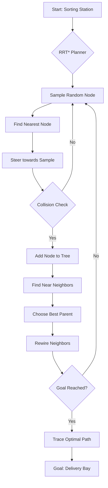

# Automated Warehouse: RRT* Motion Planning

This repository implements the **RRT*** (Rapidly-exploring Random Tree Star) motion planning algorithm, specifically tailored for an **Automated Warehouse Sorting and Routing System**.

## System Architecture



## Overview

Unlike grid-based algorithms like A*, RRT* navigates through continuous spaces by building a tree of reachable states. It dynamically optimizes the tree structure, ensuring that the found path converges to the optimal solution as more samples are added.

### Key Features

*   **Optimal Pathfinding:** Converges to the shortest path using RRT* rewiring logic.
*   **Warehouse Simulation:** Pre-configured with shelving units, processing equipment, and pillars.
*   **Dockerized Environment:** Easily run the simulation and tests in a containerized environment.
*   **Dynamic Visualization:** Real-time animation of tree expansion (saves to PNG in headless mode).
*   **Unit Tested:** Comprehensive test suite for algorithm components.

## Requirements

*   Python 3.9+
*   `numpy`
*   `matplotlib`
*   `pytest` (for testing)

## Installation & Usage

### Local Execution

1.  Clone the repository.
2.  Install dependencies:
    ```bash
    pip install -r requirements.txt
    ```
3.  Run the simulation:
    ```bash
    python rrt_planner.py
    ```

### Docker Execution

You can run the planner without installing any local dependencies:

1.  Build the Docker image:
    ```bash
    docker build -t rrt-warehouse .
    ```
2.  Run the simulation (saves `warehouse_path_plan.png` inside the container):
    ```bash
    docker run --name rrt-sim rrt-warehouse
    ```
3.  To copy the generated plot to your host:
    ```bash
    docker cp rrt-sim:/app/warehouse_path_plan.png .
    ```

## Testing

Run the unit tests:
```bash
pytest tests/
```

## Simulation Details

*   **Gray Circles:** Warehouse obstacles (shelves, equipment).
*   **Cyan Tree:** The rapidly exploring search tree.
*   **Red Path:** The optimized robot routing path.
*   **Green Circle:** Delivery Bay (Goal).
*   **Red Circle:** Sorting Station (Start).
