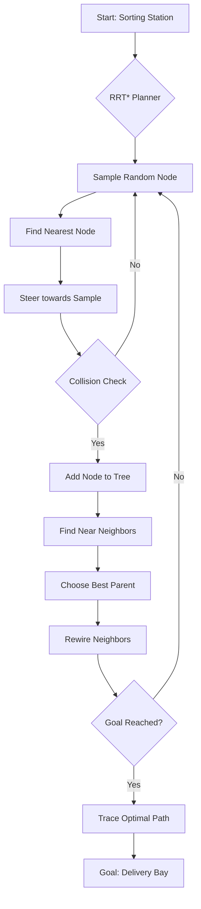
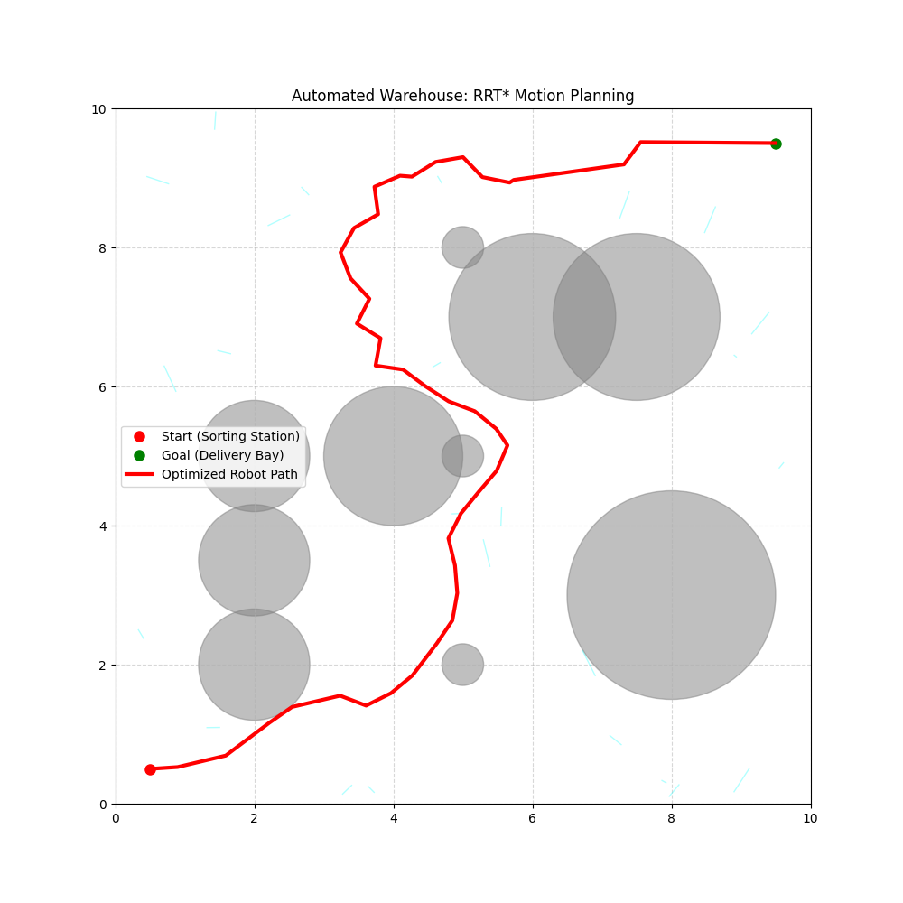

# Automated Warehouse: RRT* Motion Planning

This repository implements the **RRT*** (Rapidly-exploring Random Tree Star) motion planning algorithm, specifically tailored for an **Automated Warehouse Sorting and Routing System**.

## System Architecture



## Project Structure

The project has been refactored for modularity and high performance:

*   `src/models/`: Data structures for `Node`, `Obstacle`, and `WarehouseConfig`.
*   `src/algorithms/`: Core implementation of the `RRTStar` planner.
*   `src/utils/`: Visualization and helper utilities.
*   `src/math_foundations.jl`: High-performance Julia implementation of mathematical foundations (collision checking, distance metrics).
*   `main.py`: Main entry point for the Python-based simulation.

## Overview

Unlike grid-based algorithms like A*, RRT* navigates through continuous spaces by building a tree of reachable states. It dynamically optimizes the tree structure, ensuring that the found path converges to the optimal solution as more samples are added.

### Key Features

*   **Optimal Pathfinding:** Converges to the shortest path using RRT* rewiring logic.
*   **Warehouse Simulation:** Pre-configured with shelving units, processing equipment, and pillars.
*   **Multi-Language Foundations:** Includes a Julia engine for computational geometry performance.
*   **Dockerized Environment:** Easily run the simulation and tests in a containerized environment.
*   **Dynamic Visualization:** Real-time animation of tree expansion.

## Mathematical Foundation

The RRT* algorithm optimizes the path by minimizing a cost function $C(n)$ for each node $n$ in the tree. The core operations implemented in both Python and Julia include:

- **Euclidean Metric**: $d(q_i, q_j) = \sqrt{\sum (x_i - x_j)^2}$
- **Steer Function**: $q_{new} = q_{near} + \frac{q_{rand} - q_{near}}{||q_{rand} - q_{near}||} \cdot \Delta q$
- **Rewiring Condition**: If $C(q_{new}) + d(q_{new}, q_{near}) < C(q_{near})$, update $parent(q_{near}) = q_{new}$.

The Julia implementation in `src/math_foundations.jl` provides a high-performance reference for these operations.

## Installation & Usage

### Local Execution

1.  Clone the repository.
2.  Install dependencies:
    ```bash
    pip install -r requirements.txt
    ```
3.  Run the simulation:
    ```bash
    python main.py
    ```

### Docker Execution

You can run the planner without installing any local dependencies:

1.  Build the Docker image:
    ```bash
    docker build -t rrt-warehouse .
    ```
2.  Run the simulation (saves `warehouse_path_plan.png` inside the container):
    ```bash
    docker run --name rrt-sim rrt-warehouse
    ```

## Testing

Run the unit tests:
```bash
$env:PYTHONPATH="."; pytest tests/
```

## Simulation Output


